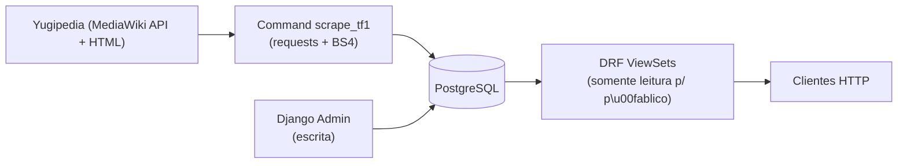

## Visão geral da arquitetura




## Decis\u00f5es de projeto (respondendo suas d\u00favidas)

- **Imagens**: `URLField` apontando para a URL direta da Yugipedia (ex.: `https://ms.yugipedia.com//...Dark_Magician.jpg`). Zero armazenamento, zero Pillow, zero `media/`. O front faz `` direto.
- **Postgres**: migrar `ENGINE` de sqlite para `django.db.backends.postgresql` via `psycopg[binary]`, carregando credenciais de `.env` com `python-decouple` ou `os.environ`.
- **Escopo**: apenas TF1 (PSP 2006). Categoria-fonte na Yugipedia: [Yu-Gi-Oh! GX Tag Force card packs](https://yugipedia.com/wiki/Category:Yu-Gi-Oh!_GX_Tag_Force_card_packs).
- **Rela\u00e7\u00e3o Pack/Card**: FK simples (`Card.pack`) conforme voc\u00ea pediu. **Observa\u00e7\u00e3o**: isso duplica cartas que aparecem em m\u00faltiplos pacotes do jogo \u2014 d\u00e1 pra refatorar pra N:N depois sem quebrar a API se mantivermos os serializers est\u00e1veis.
- **API p\u00fablica read-only**: `ReadOnlyModelViewSet` para an\u00f4nimos; escrita apenas pelo admin Django.

## Estrutura final de arquivos

```
YugiohBackEnd/
\u251c\u2500 core/
\u2502  \u251c\u2500 settings.py            # Postgres, DRF, env vars
\u2502  \u2514\u2500 urls.py                # inclui cards.urls (hoje est\u00e1 'cards.url' \u2014 bug)
\u251c\u2500 cards/
\u2502  \u251c\u2500 models.py              # Card (ajustes) + Pack novo
\u2502  \u251c\u2500 serializers.py         # PackSerializer, CardSerializer (hoje tem bug 'field')
\u2502  \u251c\u2500 views.py               # ViewSets read-only + filtros
\u2502  \u251c\u2500 urls.py                # DefaultRouter
\u2502  \u251c\u2500 admin.py               # registrar Card e Pack
\u2502  \u2514\u2500 management/commands/
\u2502      \u251c\u2500 scrape_tf1_packs.py
\u2502      \u2514\u2500 scrape_tf1_cards.py
\u251c\u2500 .env.example
\u2514\u2500 requirements.txt         # + psycopg, requests, django-filter, python-decouple, drf-spectacular
```

## Modelos (`cards/models.py`)

Adicionar `Pack` e apontar `Card.pack` como FK. Remover o `ImageField` (trocar por `image_url = URLField`). Manter as `TextChoices` j\u00e1 existentes em [cards/models.py](cards/models.py).

```python
class Pack(models.Model):
    name = models.CharField(max_length=200, unique=True)
    code = models.CharField(max_length=20, blank=True)   # ex.: "TF01-EN001"
    release_date = models.DateField(null=True, blank=True)
    description = models.TextField(blank=True)
    yugipedia_url = models.URLField(blank=True)
    cover_image_url = models.URLField(blank=True)

class Card(models.Model):
    # ...campos j\u00e1 existentes, menos card_image...
    image_url = models.URLField(blank=True)              # Yugipedia
    yugipedia_url = models.URLField(blank=True)          # fonte
    pack = models.ForeignKey(Pack, related_name="cards",
                             on_delete=models.CASCADE, null=True)
```

## Corre\u00e7\u00f5es de bugs atuais

- [cards/serializers.py](cards/serializers.py) linha 9: `field = '__all__'` \u2192 `fields = '__all__'` (hoje nenhum campo seria exposto).
- [core/urls.py](core/urls.py) linha 7: `include('cards.url')` \u2192 `include('cards.urls')` e prefixo `api/v1/`.
- [cards/admin.py](cards/admin.py): falta `admin.site.register(Card, CardsAdmin)` e registrar `Pack`.

## API (DRF)

Migrar [cards/views.py](cards/views.py) de `generics` para `ReadOnlyModelViewSet` + `DefaultRouter`, com `django-filter` e `SearchFilter`:

- `GET /api/v1/packs/` \u2014 lista pacotes
- `GET /api/v1/packs/{id}/` \u2014 detalhe do pacote (inclui cartas aninhadas)
- `GET /api/v1/cards/` \u2014 lista cartas, com filtros `?pack=`, `?card_type=`, `?attribute=`, `?monster_type=`, `?rarity=`, `?search=`
- `GET /api/v1/cards/{id}/` \u2014 detalhe da carta
- `GET /api/v1/schema/` e `/api/v1/docs/` via `drf-spectacular` (Swagger)

`PackSerializer` inclui `cards` aninhadas (resumido); `CardSerializer` exp\u00f5e `image_url` pronto para uso.

## Scraping da Yugipedia

**Estrat\u00e9gia principal**: usar a **MediaWiki API** (`https://yugipedia.com/api.php`) em vez de parsear HTML puro. \u00c9 mais est\u00e1vel, respeita rate limit e retorna JSON.

- `action=query&list=categorymembers&cmtitle=Category:Yu-Gi-Oh!_GX_Tag_Force_card_packs` \u2192 lista de pacotes.
- Para cada pacote, `action=parse&page=...&prop=wikitext` \u2192 extrair infobox (data de lan\u00e7amento, c\u00f3digo) e a tabela de cartas.
- Pa fra cada carta nova,azer outra `parse` para pegar `CardTable2` com `Attribute`, `Types`, `ATK/DEF`, `Level`, `Lore` e a URL da imagem (campo `image` do template) \u2192 resolver via `action=query&titles=File:X.png&prop=imageinfo&iiprop=url`.
- Headers com `User-Agent` pr\u00f3prio (regra da Yugipedia), `time.sleep(1)` entre requests.

**Dois management commands**:

1. `python manage.py scrape_tf1_packs` \u2014 popula `Pack`.
2. `python manage.py scrape_tf1_cards [--pack <nome>]` \u2014 popula `Card` vinculado ao `Pack`. Usa `update_or_create` pela chave `(name, pack)` para ser idempotente.

Depend\u00eancias novas: `requests`. O `beautifulsoup4` do seu [requirements.txt](requirements.txt) fica como fallback caso algum campo precise ser extra\u00eddo do HTML renderizado.

## Configura\u00e7\u00e3o Postgres + ambiente

- `.env.example` com `DB_NAME`, `DB_USER`, `DB_PASSWORD`, `DB_HOST`, `DB_PORT`, `SECRET_KEY`, `DEBUG`.
- Em [core/settings.py](core/settings.py) substituir o bloco `DATABASES` (linhas 76-81) por config de Postgres lendo do env.
- Adicionar `rest_framework`, `django_filters`, `drf_spectacular` em `INSTALLED_APPS` (hoje nenhum deles est\u00e1 em [core/settings.py](core/settings.py) linhas 33-41, apesar de `djangorestframework` estar no requirements).
- Remover `pillow` do `requirements.txt` (n\u00e3o precisa mais sem `ImageField`).

## Fluxo de uso local

1. `createdb yugioh_tf1` no Postgres.
2. `pip install -r requirements.txt`
3. `python manage.py migrate`
4. `python manage.py createsuperuser`
5. `python manage.py scrape_tf1_packs && python manage.py scrape_tf1_cards`
6. `python manage.py runserver` \u2192 testar `/api/v1/packs/` e `/api/v1/docs/`.

